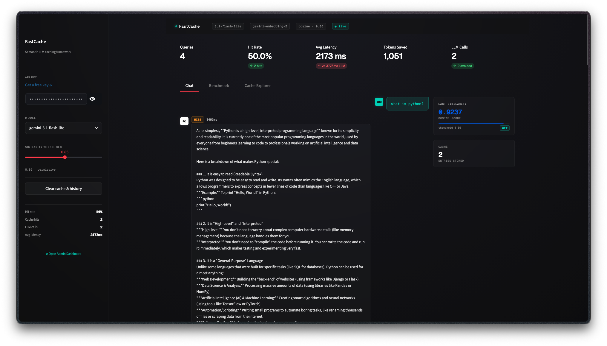
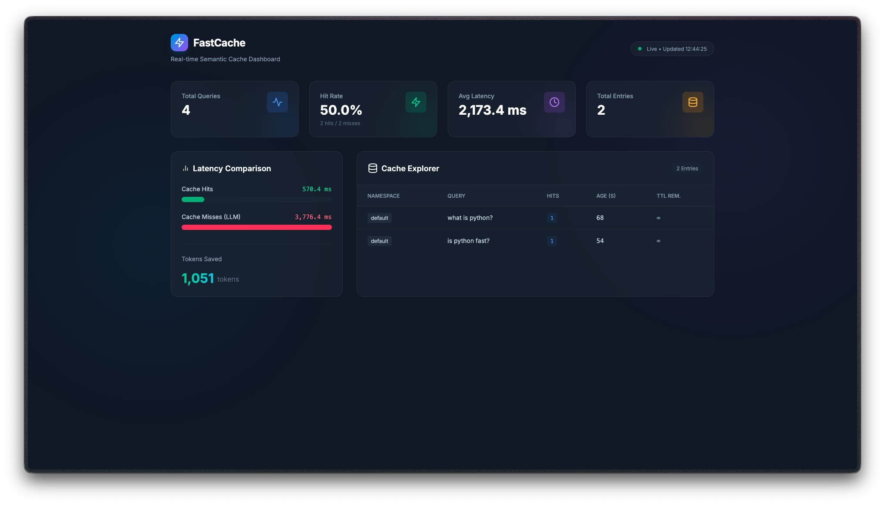

# FastCache

**A provider-agnostic, embeddable Python library for semantic caching of LLM responses.**

FastCache intercepts LLM queries, checks whether a semantically similar query has been answered before, and returns the cached response if so — skipping the LLM call entirely. A drop-in single function call. Zero required configuration. Works out of the box.

```python
# Before FastCache
response = my_llm_function(prompt)

# After FastCache — one line change, everything else automatic
response = cache.query(prompt, my_llm_function)
```

One integration gives you:

- Semantic caching with configurable cosine similarity thresholds
- Seamless fallback to your existing LLM function
- Pluggable embedders (Gemini, OpenAI) and vector stores (In-Memory, Redis)
- Built-in guardrails for prompt length and injection blocking
- Exact-match fast path bypassing embedding generation
- Native asynchronous (`async`/`await`) support
- A real-time lightweight monitoring dashboard

---

## Table of Contents

1. [Why FastCache](#why-fastcache)
2. [Architecture](#architecture)
3. [What's Inside](#whats-inside)
4. [Local Setup](#local-setup)
5. [Quick Start](#quick-start)
6. [Monitoring Dashboard](#monitoring-dashboard)
7. [Tech Stack](#tech-stack)
8. [License](#license)

---

## Why FastCache

LLM API calls are slow and expensive. Redundant queries drain budgets and degrade user experience with unnecessary latency. Standard caching mechanisms fail because natural language is variable; "What is Python?" and "Can you explain Python?" produce entirely different cache keys in a traditional system despite requiring the identical response.

FastCache solves this by embedding the query and performing a vector similarity search. 

- **Zero required configuration.** Initialize the cache, and it automatically discovers environment API keys and selects robust defaults.
- **Fail loudly.** FastCache never swallows errors silently; every failure raises a typed exception with a human-readable message and fix suggestion.
- **Provider agnostic.** FastCache is completely unopinionated about which LLM you use. The fallback function is simply a Python callable.

Every other tool requires a complex proxy infrastructure. We built the infrastructure straight into an embeddable SDK.

---

## Architecture

```
User App                                FastCache
┌──────────────────────────┐    ┌──────────────────────────┐
│                          │    │  1. Guardrails           │
│  response = cache.query( │    │  Verify length/injection │
│    prompt,               │───▶│                          │
│    llm_fallback          │    │  2. Exact Match Check    │
│  )                       │    │  SHA-256 string index    │
│                          │    │                          │
│                          │    │  3. Embedding Generation │
│                          │    │  Convert prompt to vector│
│                          │    │                          │
│                          │    │  4. Vector Search        │
│                          │    │  Cosine similarity match │
│                          │    └────────┬────────┬────────┘
│                          │             │        │
│                          │          Hit│        │Miss
│                          │             │        │
│                          │    ┌────────▼────────▼────────┐
│                          │    │ Return │ Call Fallback & │
│                          │◀───│ Cache  │ Store New Entry │
└──────────────────────────┘    └──────────────────────────┘
```

The system operates across three distinct layers:

- **Embedder Layer.** Generates float32 numpy vectors mapping the semantic intent of a prompt.
- **Store Layer.** Manages memory, TTL enforcement, and batch vector math for high-speed similarity calculations.
- **Guardrail Layer.** Provides pre-query validation before heavy LLM and network resources are consumed.

---

## What's Inside

| Module / Component              | Description                                                                 |
| ------------------------------- | --------------------------------------------------------------------------- |
| `fastcache.embedders.Gemini`    | Default embedder via `gemini-embedding-2` or `text-embedding-004`           |
| `fastcache.embedders.OpenAI`    | Standard embedder via OpenAI's `text-embedding-3-small`                     |
| `fastcache.stores.InMemoryStore`| High-performance, thread-safe memory store with Numpy matrix operations     |
| `fastcache.stores.RedisStore`   | Persistent, scalable storage using Redis hashes and exact TTL limits        |
| `fastcache.guardrails.Builtin`  | Defense layer against prompt injection and arbitrary token limits           |
| `fastcache.dashboard`           | Lightweight HTTP interface for live monitoring and cache invalidation       |

---

## Local Setup

### Prerequisites

- **Python** 3.10+
- **uv** package manager

### 1. Clone and install

```bash
git clone <repo>
cd gdg-apl-fastcache/fastcache
uv sync
```

### 2. Configure environment

Set your embedding provider API key in your environment. FastCache detects these automatically.

```bash
export GEMINI_API_KEY="your_api_key_here"
# or
export OPENAI_API_KEY="your_api_key_here"
```

---

## Quick Start

Initialize the cache and wrap your LLM function. No other configuration is required.

```python
from fastcache import SemanticCache

# Auto-detects GEMINI_API_KEY from environment
cache = SemanticCache()

def my_llm(prompt: str) -> str:
    # Your actual LLM call here
    return f"Answer to: {prompt}"

# First call — cache miss, calls my_llm (incurs normal LLM latency)
response1 = cache.query("What is Python?", my_llm)

# Second call — cache hit, returns instantly
response2 = cache.query("Can you explain Python to me?", my_llm)

print(cache.stats)
```

### Async Native

FastCache seamlessly supports `asyncio` for non-blocking workloads:

```python
response = await cache.aquery("What is FastAPI?", my_async_llm)
```

---

## Interactive Demonstration

FastCache comes with a premium, chat-based demonstration app to help you visualize semantic caching in action. This interactive demo automatically spins up the built-in administrative dashboard in the background!

```bash
# Enter the library directory
cd fastcache

# Run the frontend demonstration application
uv run streamlit run examples/app.py

# The Streamlit chat app will open on http://localhost:8501
# The built-in administrative dashboard will automatically launch on http://localhost:5555
```

The interactive demo visibly differentiates between **Cache Misses** (full API latency), **Semantic Hits** (fuzzy matches), and **Exact Matches** (SHA-256 bypass).

**Demonstration Interface:**


---

## Monitoring Dashboard

FastCache includes a built-in administrative dashboard (`fastcache.dashboard`) for real-time visibility into cache performance. 

> [!IMPORTANT]
> The dashboard **cannot run standalone**. It requires a host Python application that has already created a `SemanticCache` instance. The dashboard is extremely lightweight, relying on Python's built-in `http.server` (zero extra dependencies).

From your own application, simply call `serve_dashboard()` on your cache instance:

```python
cache = SemanticCache(dashboard=True)

# The dashboard will run in a background thread
cache.serve_dashboard(port=5555, background=True)
```

**Administrative Dashboard:**


The dashboard provides:
- Live hit rate and latency metrics (Avg Latency, Total Queries)
- Bar charts for latency distributions and namespace density
- A Cache Explorer to view all stored vectors, hit counts, and TTLs


---

## Tech Stack

- **Core Library:** Python 3.10+ · Numpy · `urllib` (no bloated dependencies)
- **Vector Storage:** Numpy array dot-products · Redis
- **Frontend Dashboard:** Built-in `http.server` · React · Tailwind CSS
- **Package Management:** `uv` · `hatchling`

---

## License

MIT
